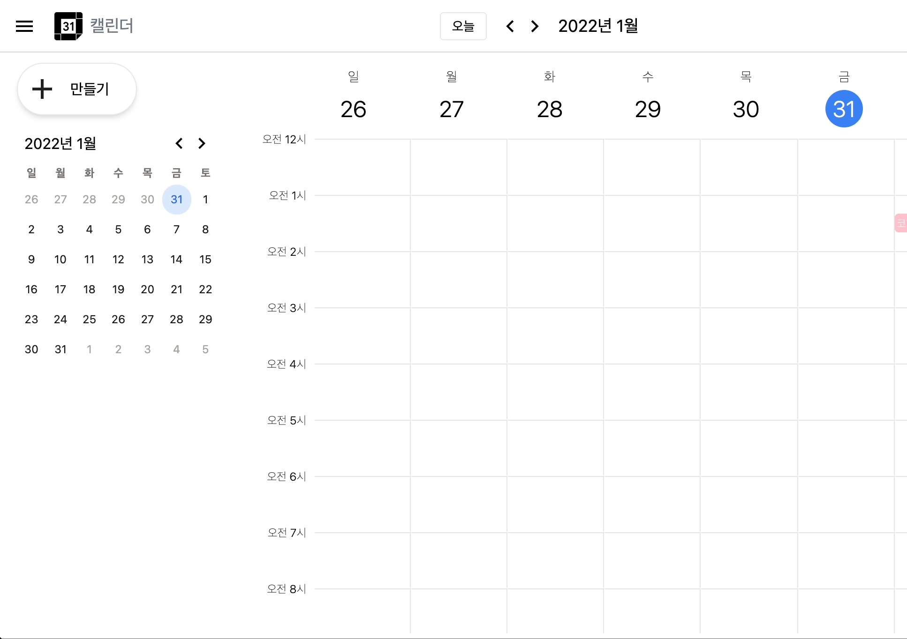
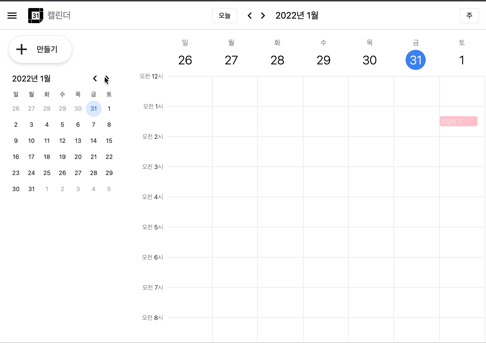
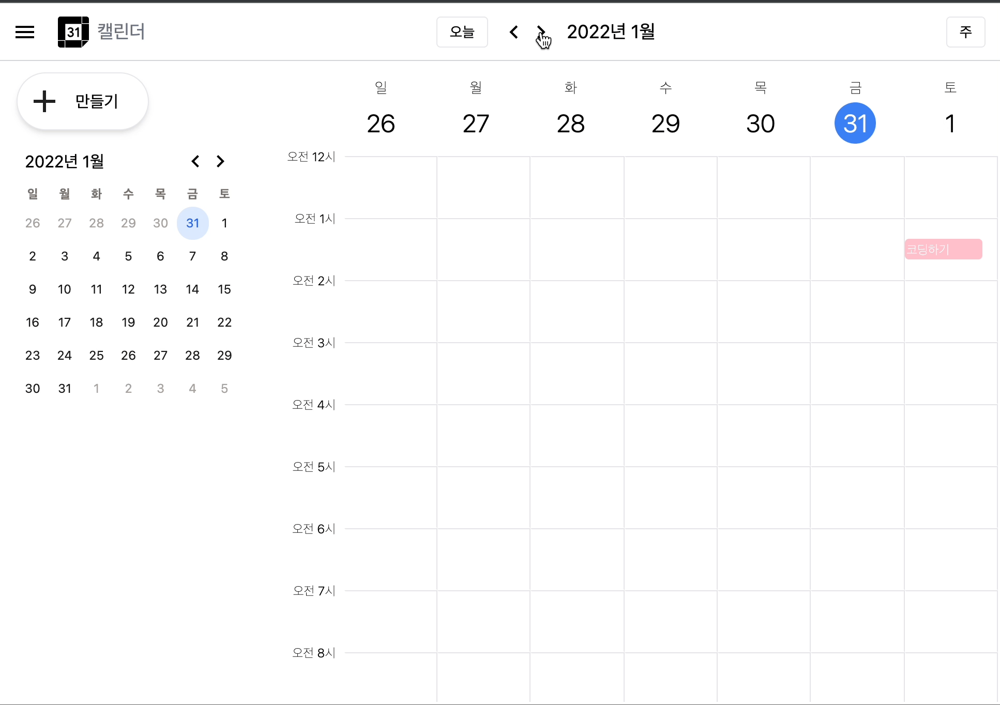
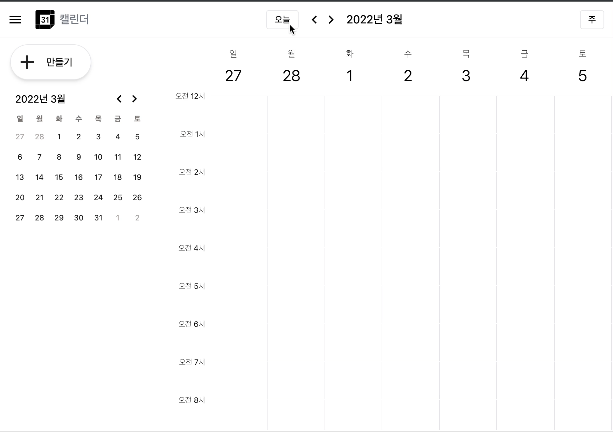
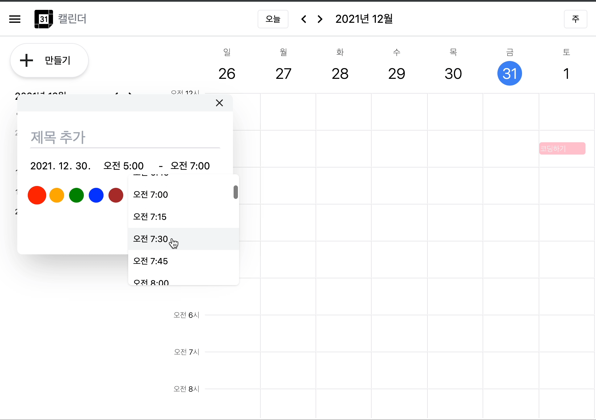
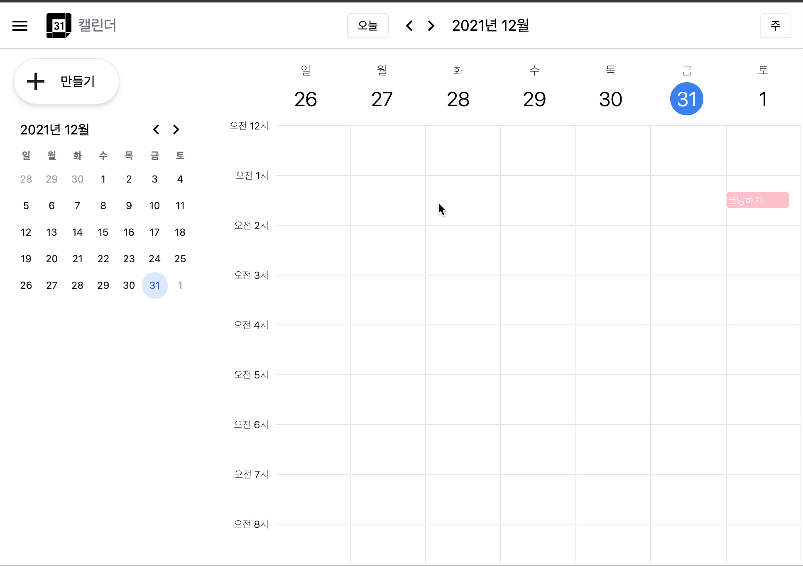
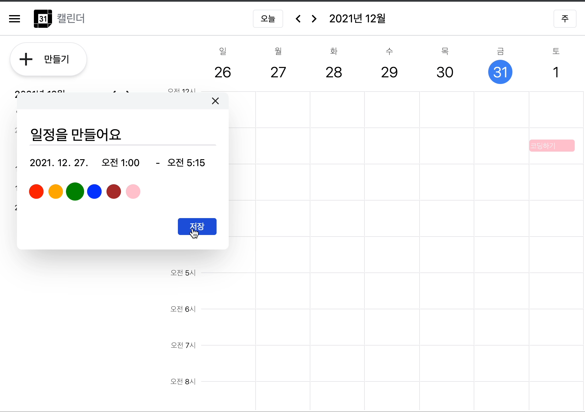
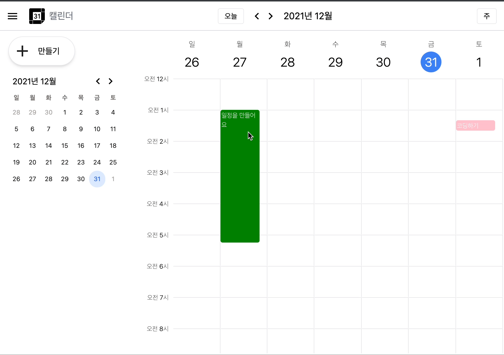
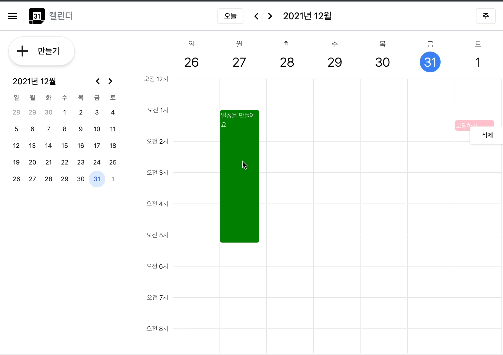
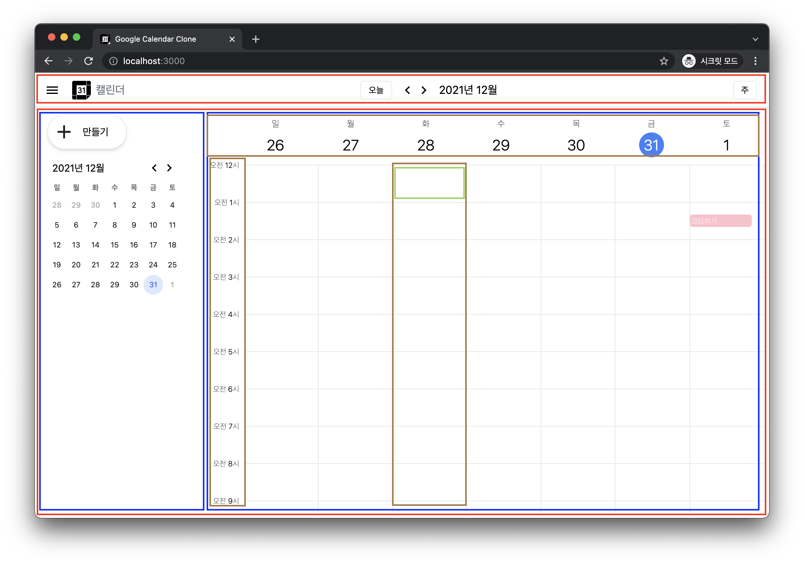

# Google Calendar Clone
> 구글 캘린더 주별 화면을 클론하여 사용할 수 있도록 함

## 실행

```shell
yarn install
yarn start
```

`localhost:3000` 접속

## 사용

- React
- CRA
- tailwind css
- typescript
- redux

## 목차

- [기능](#기능)
- [구현](#구현)
- [트러블 슈팅](#트러블-슈팅)

---

## 기능

### 반응형

화면 사이즈 및 사이드바 여부에 따라 달력의 크기도 변화

| 반응형                 | 사이드 메뉴                |
|---------------------|-----------------------|
|  |  |

### 달력 이동

| 월별 이동                | 주별 이동                | 오늘 날짜로 이동 및 날짜 선택 시 이동 |
|----------------------|----------------------|------------------------|
|  |  |    |

### 일정 만들기

| 클릭한 일정칸에 맞게 날짜와 시간 자동 반영된 모달 | 종료 시간을 시작 시간을 기준으로 변경 |
|------------------------------|-----------------------|
|         |   |

| 일정 생성                | 일정 유지                |
|----------------------|----------------------|
|  |  |

### 일정 삭제

| 커서 위치에 따른 삭제 모달      | 일정 삭제                |
|----------------------|----------------------|
|  |  |

---

## 구현

### 레이아웃



### 파일별 역할

__src/util__

| 함수                  | 역할                            |
|---------------------|-------------------------------|
| `addMonth`          | 1달 더하기                        |
| `addWeek`           | 1주 더하기                        |
| `checkIsThisWeek`   | 날짜가 포커스된 날짜의 주차에 포함되는지 체크     |
| `createSelectTimes` | 일정 생성 모달의 시간 선택 option 리스트 생성 |
| `dayOfWeek`         | 일~월까지의 한글 요일 배열               |
| `formatDay`         | yyyy-mm-dd 형식으로 변환            |
| `getCalendar`       | 포커스된 월의 데이터 생성                |
| `getThisWeek`       | isThisWeek 가 표시된 1주 추출        |
| `hours24`           | 24시간 리스트 생성                   |

__src/components__

| 함수                  | 역할               |
|---------------------|------------------|
| `AddScheduleButton` | 왼쪽 위의 일정 생성 버튼   |
| `AddScheduleModal`  | 일정 생성 모달         |
| `Header`            | 헤더               |
| `ScheduleCalendar`  | 주별 달력            |
| `SideCalendar`      | 사이드바 월별 달력       |
| `SideCalendarTitle` | 사이드바 월별 달력의 헤더영역 |

__src/store/module__

| 함수         | 역할            |
|------------|---------------|
| `calendar` | 포커스된 날짜 기준 달력 |
| `schedule` | 일정            |

### 달력 이동

1. `redux` 를 사용
2. 달력 이동 시 `nextWeek` 등의 리듀서 실행
3. 변경된 데이터가 관련 컴포넌트에 자동 반영

```
{
  select: 월 달력에서 날짜 선택 시,
  current: { 월별 이동, 주별 이동 등 포커스 이동에 따라
    days: 포커스된 월 달력 리스트,
    day: 현재 포커스된 날짜, 
    year: 포커스된 년도,
    month: 포커스된 월,
  },
}
```

- `day, year, month` 를 저장하는 이유
    - 달력 타이틀에 쉽게 반영하기 위해

### 일정 생성

1. `redux` 를 사용
2. 날짜를 key로 value를 배열로 사용하는 데이터 형태 사용
3. 시작 시간, 종료 시간 저장

```
 '2022-01-01': [
    {
      start: { hour: 1, minute: 20 },
      end: { hour: 1, minute: 40 },
      color: 'pink',
      title: '코딩하기',
    },
  ],
```

- `hour` 과 `minute` 을 따로 저장하는 이유
  - 일정 컴포넌트를 생성할 때 높이를 쉽게 지정하기 위해
  - `높이 = (end.hour - start.hour) * (한 칸 높이) - start.minute + end.minute`

### 일정 삭제

- 해당 일정의 key(날짜)와 배열 index 값을 사용해서 삭제

```
delete 일정[날짜][순서(index)]
```

### 일정 모달 시간 제어

- 시작 시간 <= 종료 시간이 되도록
- 가능한 시간의 수로 배열 생성
  - 0~24 시
  - 00, 15, 30, 45 분
- 선택한 시작 시간이 종료 시간의 Index보다 클 경우
  - 종료 시간의 Index을 변경

```
if (endSelectTimeIndex < startSelectTimeIndex) {
    endTimeChange(...)
  }
```

### 일정 생성 모달 보여주기/숨기기

1. 부모 컴포넌트에서 `useState` 로 state 생성
2. 일정 모달 트리거가 있는 자식 요소에 `SetStateAction` 전달
3. 자식 요소에서 `SetStateAction` 로 제어

- 부모 요소에서 `state` 생성한 이유
  - 왼쪽 위의 일정 생성 버튼 트리거도 같은 모달컴포넌트를 사용하기 위해

### 달력 클릭시 일정 모달에 날짜, 시간 반영하기

- 모달의 `Input` 값을 `state` 로 적용
- 달력의 날짜 클릭시 모달 `Input state` 를 변경

---

## 트러블 슈팅

### redux state에 Date가 저장되지 않음

__문제__  
- redux state에 `Date` 타입의 값을 넣었더니 에러

__해결__  
- Json에는 `Date` 형식이 없다는 것을 학습
- `string` 으로 변환하여 저장

### 월 이동 시 두 달이 넘어가는 문제

__문제__  
- 예) 1월 31일이 선택된 상태에서 다음 월(2월)로 이동 시 3월로 넘어감
  - `new Date(2021, 1, 31)` === `Mar 03 2021`

__수정__  
- 월 이동 시 포커스를 무조건 `1일` 로 설정

__해결 방법으로 생각 중__  
- 이동할 달의 마지막 날을 알아낸 뒤,
- 현재 포커스된 날과 비교하여 제어

### 날짜 지정이 안되는 문제

__문제__  
- `2021-1-1` 와 같은 형태는 `input type=date` 에 값으로 넣을 수 없음

__해결__  
- `2021-01-01` 과 같은 형태로 변형
- `month < 10 ? `0${month}` : month`

### 일정 컴포넌트 높이 지정 문제

__문제__  
- 시간 시간과 종료 시간이 같을 때 일정 컴포넌트 생성 시 높이가 생기지 않음
- 높이 : `(end.hour - start.hour) * (한 칸 높이)` 

__해결__  
- `if (h < 20) h = 20` 추가
- 높이가 20보다 작을 경우 무조건 20의 높이 지정

### 삭제 모달 띄울때 위치 문제

__문제__  
- 일정 컴포넌트의 2/3 지점을 삭제 모달 위치로 지정
- 높이가 길어 스크롤을 해야하는 일정의 경우 가려져서 모달이 안보임

__해결__  
- 클릭했을 때 마우스 값을 가져와서 위치로 지정

---

## 학습한 내용

### tailwind css  
- 유틸리티 퍼스트(Utility-first)를 지향하는 CSS 프레임워크
  - 유틸리티 퍼스트?
    - 스타일을 미리 정의해두고 조합하는 식의 효용성을 가진다
- `flex, pt-4, text-center` 등 유틸리티 클래스 사용
- 일관된 스타일을 구현하기 쉬움
- 작은 Element를 만들 때에도 Component를 생성해야하는 Styled에 비해 편하다.
